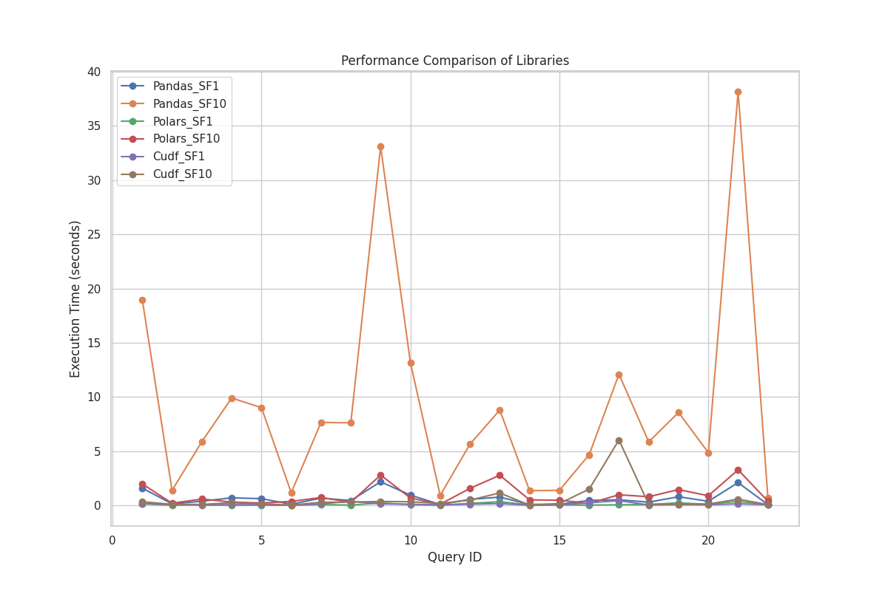
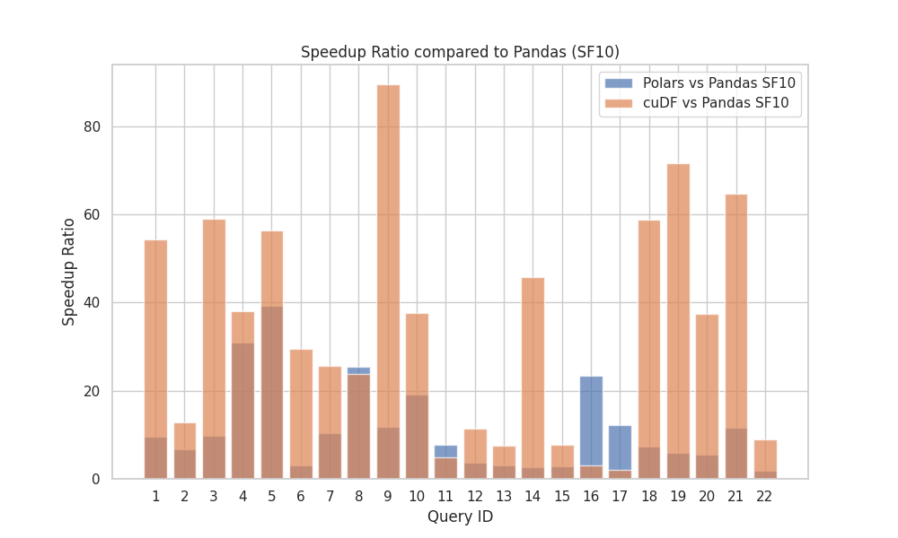

(sec-ad-hoc-query)=
# Ad-hoc Query

## TPC-H
### Single Node

#### Overall Analysis

We conducted TPC-H benchmark tests on Pandas, Polars, and cuDF using datasets of different sizes (1GB, 10GB). We analyzed and compared the execution times of each query across these libraries. The summarized results below depict the performance of Pandas, Polars, and cuDF on SF1 (1GB data) and SF10 (10GB data).

From the above results, it's evident that as the dataset size increases, the execution times of all libraries for each query tend to increase. Notably, Pandas takes longer for queries Q1, Q9, and Q21; Polars shows longer execution times for Q9, Q13, and Q21; and cuDF takes longer for Q8 and Q17, with Q17 exhibiting a performance bottleneck as data size increases.。

Horizontal comparison reveals that as the dataset expands to 10GB, Pandas's efficiency significantly lags behind Polars and cuDF. Polars and cuDF demonstrate notable acceleration, as illustrated in the following graph:

Furthermore, we analyzed the speedup ratios of Polars and cuDF relative to Pandas for each query to better understand performance.

In the SF1 dataset, Polars exhibits remarkable acceleration for Q4, Q5, Q8, Q16, and Q17, surpassing cuDF. Conversely, cuDF demonstrates exceptional acceleration for Q9, Q19, and Q21, outperforming Polars significantly:。

In the SF10 dataset, except for Q16 and Q17, cuDF consistently shows impressive acceleration compared to Polars, suggesting that cuDF is more suitable for comparative analysis as dataset size increases:


#### Polars
We ranked Polars' speedup ratios relative to Pandas for each query and selected the top three queries where Polars achieved the highest acceleration over Pandas for further analysis.

Polars demonstrates substantial speedup ratios for Q5 and Q4 across different dataset sizes.

1. For Q5, which involves multiple table joins, a common performance bottleneck in program execution, the comparison between Pandas and Polars handling:

    ```python
    # Pandas
    rsel = region.R_NAME == region_name
    osel = (orders.O_ORDERDATE >= date1) & (orders.O_ORDERDATE < date2)
    forders = orders[osel]
    fregion = region[rsel]
    jn1 = fregion.merge(nation, left_on="R_REGIONKEY",right_on="N_REGIONKEY")
    jn2 = jn1.merge(customer, left_on="N_NATIONKEY",right_on="C_NATIONKEY")
    jn3 = jn2.merge(forders, left_on="C_CUSTKEY", right_on="O_CUSTKEY")
    jn4 = jn3.merge(lineitem, left_on="O_ORDERKEY", right_on="L_ORDERKEY")
    jn5 = supplier.merge(
        jn4, left_on=["S_SUPPKEY", "S_NATIONKEY"], right_on=["L_SUPPKEY","N_NATIONKEY"]
    )
    jn5["REVENUE"] = jn5.L_EXTENDEDPRICE * (1.0 - jn5.L_DISCOUNT)
    gb = jn5.groupby("N_NAME", as_index=False)["REVENUE"].sum()
    total = gb.sort_values("REVENUE", ascending=False)

    # Polars
    region_ds.join(nation_ds, left_on="R_REGIONKEY", right_on="N_REGIONKEY")
            .join(customer_ds, left_on="N_NATIONKEY", right_on="C_NATIONKEY")
            .join(orders_ds, left_on="C_CUSTKEY", right_on="O_CUSTKEY")
            .join(line_item_ds, left_on="O_ORDERKEY", right_on="L_ORDERKEY")
            .join(
                supplier_ds,
                left_on=["L_SUPPKEY", "N_NATIONKEY"],
                right_on=["S_SUPPKEY", "S_NATIONKEY"],
            )
            .filter(pl.col("R_NAME") == region_name)
            .filter(pl.col("O_ORDERDATE").is_between(date1, date2, closed="left"))
    ```
    Polars' join function significantly enhances table join performance.

2. For Q4, which includes exists-related subqueries, comparing Pandas and Polars handling:

    ```python
    # Pandas
    lsel = lineitem.L_COMMITDATE < lineitem.L_RECEIPTDATE
    osel = (orders.O_ORDERDATE < date1) & (orders.O_ORDERDATE >= date2)
    flineitem = lineitem[lsel]
    forders = orders[osel]
    jn = forders[forders["O_ORDERKEY"].isin(flineitem["L_ORDERKEY"])]

    # Polars
    line_item_ds.join(orders_ds, left_on="L_ORDERKEY", right_on="O_ORDERKEY")
            .filter(pl.col("O_ORDERDATE").is_between(date1, date2, closed="left"))
            .filter(pl.col("L_COMMITDATE") < pl.col("L_RECEIPTDATE"))
    ```
    Polars' optimization with filter and join functions improves query performance.

3. For Q16, which involves not in subqueries, comparing Pandas and Polars handling:
    ```python
    # Pandas
    supplier_filtered = supplier[supplier["S_COMMENT"].str.contains("CUSTOMER.*COMPLAINTS")]
    filtered_df = pd.merge(filtered_df, supplier_filtered["S_SUPPKEY"], left_on="PS_SUPPKEY", right_on="S_SUPPKEY", how="left")
    filtered_df = filtered_df[filtered_df["S_SUPPKEY"].isna()]

    # Polars
    .join(
        supplier_ds.filter(
            pl.col("S_COMMENT").str.contains(".*CUSTOMER.*COMPLAINTS.*")
        ).select(pl.col("S_SUPPKEY")),
        left_on="PS_SUPPKEY",
        right_on="S_SUPPKEY",
        how="left",
    )
    ```
    Polars' approach within join is more user-friendly than Pandas.

4. Q8 also involves multiple table joins, similar to Q1.

In summary, Polars is highly effective for tasks involving complex queries with multiple table joins or exists and not in conditions.

#### cuDF
Similarly, we ranked cuDF's speedup ratios relative to Pandas for each query and selected the top three queries where cuDF achieved the highest acceleration over Pandas for further analysis.

cuDF demonstrates significant speedup ratios for Q9, Q21, Q1, and Q19 across different dataset sizes. cuDF exhibits excellent portability compared to Pandas, requiring minimal code modifications, as demonstrated below:
```python
import cudf.pandas
cudf.pandas.install()
```

1. For Q9, a complex query involving six table joins:
2. For Q21, a complex query involving exists and not exists subqueries with four table joins:
3. For Q1, which involves eight aggregate functions:
4. For Q19, which involves multiple or conditions with multiple column filtering.

In conclusion, when dealing with large datasets, I recommend using cuDF to accelerate your data processing tasks. Even if you're not a programmer, I still recommend using cuDF due to its exceptional portability. The ease of migrating to cuDF is simply outstanding!

During the TPC-H testing process, we noted differences between cuDF's API and Pandas, which are useful for migration:

1. Convert cudf DataFrame to Pandas DataFrame and format timestamp
    ```python
    # cuDF
    # use to_datetime().dt.strftime("%Y-%m-%d")
    total["O_ORDERDATE"] = pd.to_datetime(total["O_ORDERDATE"]).dt.strftime("%Y-%m-%d")
    ```
2. groupby.agg is a `Series` and convert `Series` to `DataFrame`
    ```python
    # cuDF 
    total = count_df.groupby(["C_COUNT"], as_index=False).size()
    # reset a new index
    total = total.reset_index(name='size')
    ```


### Multi-Node

